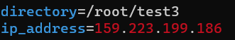
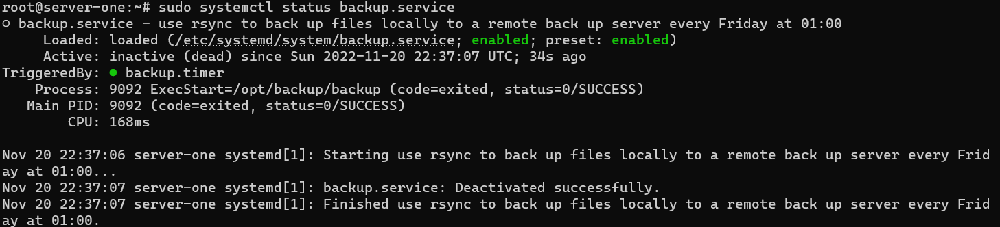
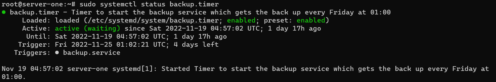
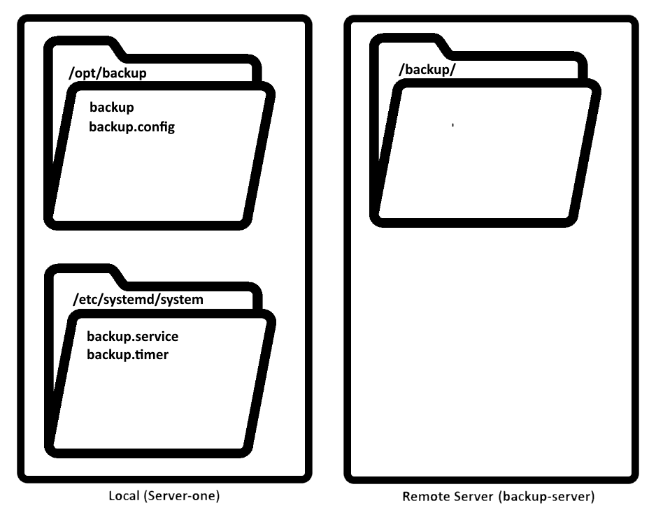

# ACIT 2420 Week 11 Lab: Back up Project

## Team Members
Dennis Phan (A01073874)  
Raqin Shikder (A01265891)

## Backup
Script to backup the directories to a remote server automated by using unit files such as service and timer

## How to Install the Project

### backup
How to install the backup script and ensure it is functional:

1. Create a directory */opt/backup* using `mkdir /opt/backup`.
2. Save this script into the directory you created above.
3. Ensure your ssh private key is inside the .ssh folder and public key is in your .ssh folder in your back up server
4. Create a config file named `backup.config` and put it into the same folder as the script above.

In this configuration file, you will have two variables: `directory` and `ip_address`.
You can customize the values to your liking. 

5. Declare `directory` for directory or directories you want to backup.
6. Declare `ip_address` to the intended remote server you want to back up the directories to.

7. Create a directory in your back up server's home directory called *backup* using `mkdir backup`.

Now, if you followed the steps, the command found in `backup` should work:

### backup.service
1. Save this unit file into */etc/systemd/system* directory.
2. Using the command `sudo systemctl enable backup.service` to enable the service file.
3. Run the command `sudo systemctl status backup.service` to check that **backup.service** file is enabled.

### backup.timer
1. Save this unit file into */etc/systemd/system* directory.
2. Using the command `sudo systemctl enable backup.timer` to enable the timer file.
3. Run the command `systemctl status backup.timer` to check that **backup.timer** file is enabled.
4. [Optional] Run the command `sudo systemctl list-timers` to check that backup.timer is scheduled to run around 01:00:00 every Friday

### Apply changes
After you enable the unit files above,
run the command `sudo systemctl daemon-reload` to reload configuration. 
This will apply the changes.

An overview of directories and files:

## To test the unit files
